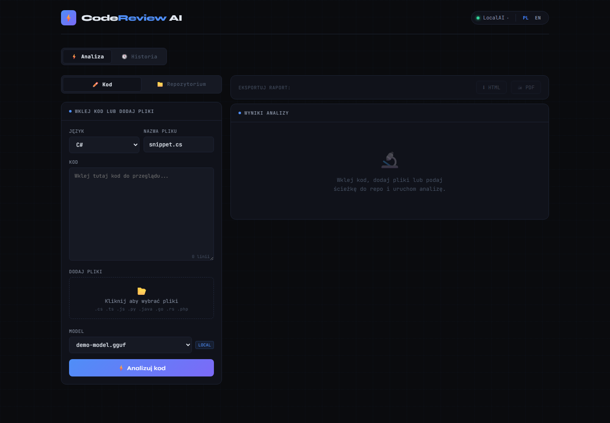
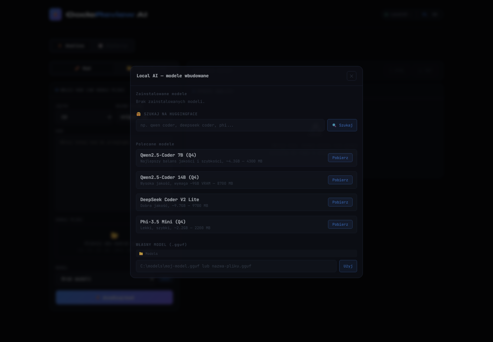
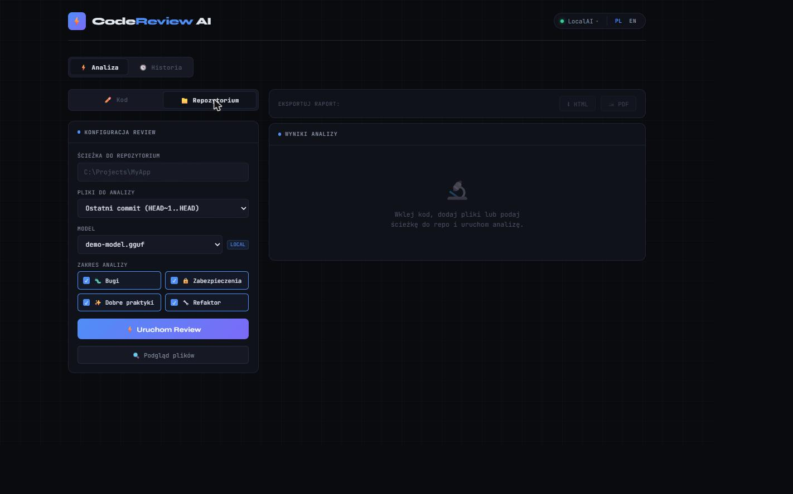
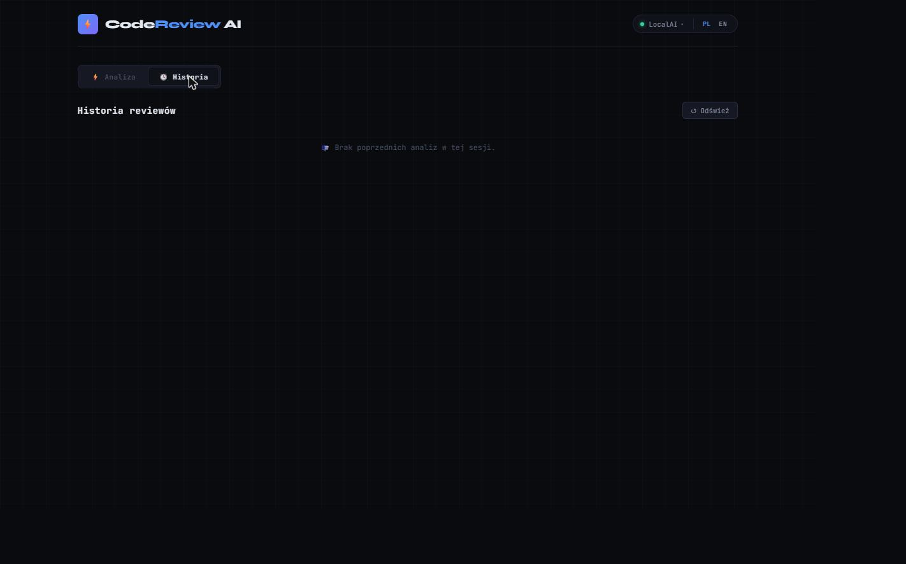

# Reviq — AI Code Review

Reviq is an AI-powered code review tool. It can analyze a single pasted code snippet, a whole batch of files, changes in a local git repository, or automatically react to a GitHub/GitLab pull-request webhook — all with a choice of any AI provider (local or cloud).

Backend: ASP.NET Core Web API (.NET 10) in Clean Architecture + CQRS. Frontend: static, browser-only (vanilla JS, ES modules, no bundler).

## Screenshots

| Code analysis (paste/upload files) | Local AI model management |
|---|---|
|  |  |

| Git repository review | Analysis history |
|---|---|
|  |  |

## Features

- **Pasted code analysis** — paste a code snippet (or several files at once) and get a score (0–100), a list of issues split into Critical/Warning/Info, suggestions, and a before/after diff for selected issues.
- **Local git repository review** — point Reviq at a repo path and pick a diff scope: last commit, changes since the last push, uncommitted changes, or all files. Reviq runs `git diff`/`git ls-files` itself (via the `git` CLI) and sends the changed files to the AI.
- **Automatic PR review (webhook)** — `POST /api/webhook/github` and `POST /api/webhook/gitlab` receive `pull_request`/`merge_request` webhooks, fetch the changed files from the PR, run an AI analysis, and post the result back as a PR comment + commit status.
- **Local AI models (offline)** — a built-in engine on top of **LLamaSharp**/llama.cpp (CPU, CUDA 12, Vulkan) for running `.gguf` models without sending code anywhere. Search and download models directly from Hugging Face, manage downloaded files from the UI.
- **Multiple AI providers, switchable on the fly** — switch provider and model without restarting the app, with a live availability status for each.
- **Analysis history** — a list of past reviews with a detail view (kept in the process's memory — see [Known Limitations](#known-limitations--ideas-for-improvement)).
- **Report export** — export an analysis result as a standalone HTML file, or print/save it as PDF.
- **PL/EN** — a fully localized UI with a language switcher (JSON-based i18n, no external libraries).

### Supported AI providers

| Provider | Type | Requires |
|---|---|---|
| **LocalAI** | local (LLamaSharp/llama.cpp, in-process) | a `.gguf` file in the models folder |
| **Ollama** | local (HTTP server) | a running `ollama serve` (default `localhost:11434`) |
| **LM Studio** | local (HTTP server, OpenAI-compatible) | a running LM Studio (default `localhost:1234`) |
| **Claude** | cloud | an Anthropic API key |
| **OpenAI** | cloud | an OpenAI API key |
| **Groq** | cloud | a Groq API key |
| **OpenRouter** | cloud | an OpenRouter API key |

## Architecture

Clean Architecture across 4 projects, dependencies pointing inward, CQRS via a self-hosted, free mediator source generator (`Mediator.SourceGenerator` — no MediatR v13+ commercial license required):

```
Presentation/API  ─┐
Infrastructure    ─┼──►  Application  ──►  Domain
```

- **Reviq.Domain** — entities (`ReviewResult`, `FileReview`, `ReviewIssue`, `WebhookPayload`...), enums, value objects, port interfaces (`IGitProvider`, `IGitHostProvider`, `IReviewRepository`). No outward dependencies.
- **Reviq.Application** — use-case logic as Commands/Queries (feature folders: `Features/Reviews`, `Features/Webhook`, `Features/Git`, `Features/AI`), validation via FluentValidation, DTOs, mapping.
- **Reviq.Infrastructure** — port implementations: AI providers, GitHub/GitLab integrations, local repo operations, LocalAI/Hugging Face engine, repository (in-memory).
- **Reviq.API** — controllers as a thin layer translating HTTP → Mediator, middleware, DI configuration, static frontend under `wwwroot`.

### Project structure

```
Reviq.Domain/
├── Entities/            # ReviewResult, FileReview, ReviewIssue, WebhookPayload, PrFile...
├── Enums/                # IssueSeverity, IssueCategory, ProviderName, DiffScope...
├── Interfaces/           # IGitProvider, IGitHostProvider, IReviewRepository
└── ValueObjects/         # ProviderInfo

Reviq.Application/
├── Common/                # AIResponseParser, ReviewSummaryBuilder, ValidationBehavior
├── DTOs/
├── Features/
│   ├── AI/Queries/            # provider status
│   ├── Git/Queries/           # repo info
│   ├── Reviews/Commands+Queries/  # snippet/batch/repo review, history
│   └── Webhook/Commands/      # PR webhook handling
├── Interfaces/            # IAIProvider(Factory), IGitHostProviderFactory, ILocalAIService...
└── Requests/

Reviq.Infrastructure/
├── AI/
│   ├── Providers/         # LocalAI, Ollama, Claude, OpenAI, Groq, OpenRouter, LMStudio
│   └── Parsing/           # prompt building
├── Configuration/         # options classes (Options pattern)
├── Git/                   # GitService (CLI), GitHub/GitLab providers, PR file fetcher
├── LocalAI/
│   ├── HuggingFace/       # model search/download client
│   ├── Models/
│   └── Services/          # downloaded .gguf model management
└── Persistence/           # ReviewRepository (in-memory)

Reviq.API/
├── Controllers/           # Code, Review, Git, History, AI, LocalAI, Webhook
├── Middleware/             # ErrorHandlingMiddleware
├── Requests/ / Responses/  # HTTP contracts
└── wwwroot/                # frontend (ES modules, no bundler)
    ├── css/
    ├── js/                  # api.js, i18n.js, providers.js, review.js, results.js,
    │                        # localai.js, history.js, export.js, app.js...
    └── locales/             # pl.json, en.json
```

## Getting started

**Requirements:** .NET 10 SDK, `git` available on PATH (for local repository reviews). Optional: [Ollama](https://ollama.com)/[LM Studio](https://lmstudio.ai) running locally, or an API key for one of the cloud providers.

```bash
git clone <repo-url>
cd Reviq
dotnet build
cd Reviq.API
dotnet run
```

The app starts on `http://localhost:5000` — both the frontend (`/`) and Swagger (`/swagger`) are served from the same address.

### Configuration (`Reviq.API/appsettings.json`)

| Section | Key | Description |
|---|---|---|
| `Ollama` | `BaseUrl`, `DefaultModel` | address of the local Ollama server |
| `LocalAI` | `ModelsDir` | folder for downloaded `.gguf` files |
| `AI:Claude` / `OpenAI` / `Groq` / `OpenRouter` / `LMStudio` | `ApiKey`, `BaseUrl`, `DefaultModel` | credentials for cloud providers — empty by default, in which case the provider is reported as unconfigured |
| `Git:GitHub` / `GitLab` | `Token` | token used when handling webhooks (PR comment, commit status) |

All API keys ship empty in the repository — never commit real secrets there; for local work use `appsettings.Development.json` or [user-secrets](https://learn.microsoft.com/aspnet/core/security/app-secrets).

### Recently fixed

- **Scoped `IMediator` used after the request scope was disposed** — webhook handling (`WebhookController`) processed requests fire-and-forget via `Task.Run`, using the scoped `IMediator` injected into the controller. Once the HTTP response was sent, the request scope (and the mediator's dependencies with it) was disposed, risking a background `ObjectDisposedException` and silently swallowed failures. Fixed by creating a dedicated scope via `IServiceScopeFactory` for the background work, plus `try/catch` with logging.
- **Swagger UI exposed in production** — `app.UseSwagger()`/`UseSwaggerUI()` ran unconditionally. Now gated behind `app.Environment.IsDevelopment()`.
- **Hardcoded listen address** — `app.Run("http://localhost:5000")` ignored `ASPNETCORE_URLS`/`--urls`/environment variables. Replaced with `app.Run()` and a configurable `Urls` default in `appsettings.json` — still works out of the box on the same port, but can now be overridden without recompiling (e.g. in a container).

## Known limitations & ideas for improvement

What's genuinely worth fixing/adding to take this from "solid MVP" to "production-ready":

- **In-memory persistence only** — `ReviewRepository` is a `ConcurrentDictionary`, so history is lost on every app restart. The most important gap — worth backing the existing `IReviewRepository` interface with a real database (EF Core + SQLite to start, PostgreSQL for production), so the swap needs no changes in Application/Domain.
- **No tests** — there isn't a single test project in the solution. Domain and Application (parsers, builders, handlers) are well suited to pure unit tests without HTTP/DB mocks; a good starting point would be `AIResponseParser`, `ReviewSummaryBuilder`, `WebhookReviewParser`.
- **CORS `AllowAnyOrigin/Header/Method`** — hardcoded wide open in `Program.cs`; fine for dev, but needs narrowing to specific origins for production.
- **No authorization/authentication** — every endpoint (including running a review or managing providers/models) is publicly accessible. Exposing this beyond `localhost` needs at least minimal auth (API key / JWT).
- **Webhooks without signature verification** — `WebhookController` doesn't check `X-Hub-Signature-256` (GitHub) or a webhook token (GitLab), so anyone who knows the URL can trigger a fake review. Worth addressing before exposing this to the internet.
- **No rate limiting / queue for webhooks** — `HandleWebhookCommand` runs fire-and-forget with no concurrency limit; under heavier PR traffic this should go through a queue (e.g. `Channel<T>` or Hangfire). (The scoped-dependency leak and missing error logging in this fire-and-forget path have already been fixed — see above.)
- **Frontend has no tests and no TypeScript** — the ES modules are already split with clear boundaries, but it's still untyped JS; migrating to TS (or at least JSDoc + `checkJs`) would catch things like typos in object keys before they reach production.
- **appsettings ships with empty API keys in the repo** — works fine, but it's worth adding a `.gitignore` entry for `appsettings.*.Local.json` / documenting user-secrets, so nobody accidentally commits a real key.
- **No health checks / observability** — no `/health` endpoint or metrics; useful for real hosting (e.g. to verify the configured AI provider is actually responding).

## Tech stack

- **.NET 10**, latest C# language version, `Nullable` + `ImplicitUsings` enabled across all projects
- **Mediator.SourceGenerator** — CQRS with no runtime overhead (compiled mediator, a free alternative to commercially-licensed MediatR 13+)
- **FluentValidation** — command/query validation as a pipeline behavior
- **LLamaSharp** (CPU/CUDA12/Vulkan) — local `.gguf` models
- **Swashbuckle/Swagger** — API documentation
- Frontend: **vanilla JS (ES modules)**, no framework, no build tooling
